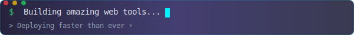
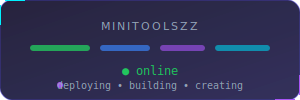

  

  

  
  
  

  

## 👋 About Me

> 🚀 Passionate about building **fast, modern, and user-friendly web tools** that help people save time and improve productivity.

> 💡 I enjoy creating **browser-based utilities** that simplify everyday tasks — no downloads, no installations, just instant access.

> ⚡ **Built for Speed & Simplicity** — every tool is designed to load instantly and work seamlessly.

  

  

## 💻 Tech Stack

### Languages

  
  
  
  
  

### Frameworks & Runtimes

  
  
  
  

### Styling

  
  

### Tools & Platforms

  
  
  
  
  
  

  

  

## 📊 GitHub Stats

  
  

  

  

  

## 🏆 GitHub Trophies

  

  

## 🌐 Connect with Me

  
  
  

  

## 🏗️ Let's Build Something Amazing

  
  
  

  

  

  

  

  Built with ❤️ by <b>Minitoolszz</b> • ⚡ Speed is everything

